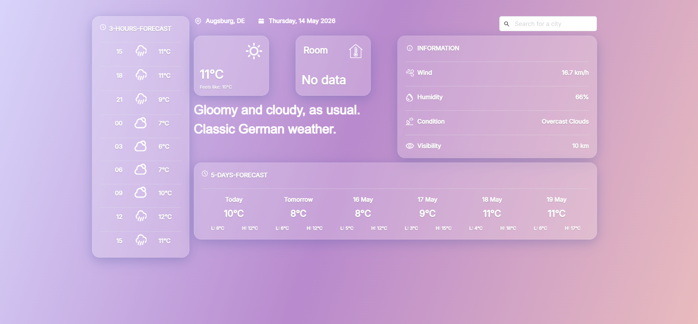

# Weather App 

A browser-based **weather dashboard** with current conditions, short-term outlooks, and city search. The UI is **German-first** (title: “Wetter”) with a polished **glassmorphism** layout (gradient background, frosted panels, **Inter** typography, **Bulma** CSS).^



Visit page on: https://meryem9907.github.io/weatherapp/

This repository folder currently holds a **compiled release** (HTML, CSS, JavaScript glue, and WebAssembly). It is suitable for a **static host** (any CDN or object storage with HTTPS).

---

## Introduction

**Single-page weather client shipped as Rust → WebAssembly, with declarative UI in Leptos, async HTTP via the browser stack, and a conventional CSS framework—demonstrating systems language skills applied to the frontend.**

---

## Technical stack 

| Area | Choice |
|------|--------|
| Language | **Rust** |
| UI framework | **Leptos** (0.7.x) |
| Delivery | **WebAssembly** (`wasm-bindgen`), bundled with **Trunk** |
| HTTP | **gloo-net** (async fetch from WASM) |
| Styling | **Bulma** + custom CSS (glass panels, gradients) |
| Data | **OpenWeatherMap** REST API (current weather + forecast endpoints, metric units) |
| Optional extra | Hooks for a **local “room temperature”** endpoint (custom integration) via a microcontroller e.g. BME280 Sensor Module -> Mini D1 ESP32. |

---

## Product / feature highlights

- **Current weather** view with main conditions, wind, visibility-style details, and iconography.
- **Forecast** surfaces: multi-day and **3-hour** style breakdowns (aligned with common forecast API shapes).
- **City search** to query locations by name.
- **Playful condition copy**.
- **Subresource integrity** on scripts and styles in `index.html`-

---

## How to run this folder locally

You need a **static file server** (WASM modules are often blocked by `file://` CORS rules).

Example with Python:

```bash
cd weatherapp
python -m http.server 8080
```

Then open `http://localhost:8080`. The app will call **OpenWeatherMap** from the browser.

---


## License 
Apache License 2.0
